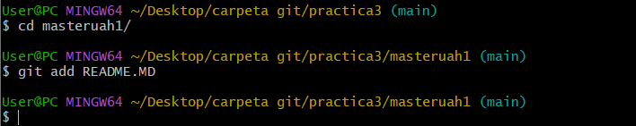
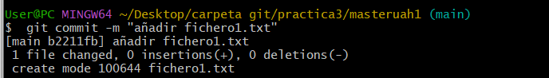

hacemos un git clone 

 
<h1>Añadimos un git add para añadir el archivo leadme</h1>

 
<h1>Añadimos algo en el readme</h1>

 
<h1>Añadimos el fichero1.txt con un git add</h1>

 
<h1>hacemos un git commit para guardarlo</h1>

 
<h1>Añadimos una etiqueta con un git tag v0.1</h1>

 
<h1>Hacemos un git tag push</h1>

 
<h1>creamos una rama git branch v0.2</h1>

 
<h1>creamos un fichero2.txt</h1>

 
<h1>Lo añadimos y hacemos un git commit</h1>

 
<h1>Hacemos un git push</h1>

 
<h1>Cambiamos de rama y hacemos un merge</h1>

 
<h1>Cambiamos a la rama v0.2 y añadimos el fichero1.txt</h1>

 
<h1>Hacemos un git commit</h1>

 
<h1>Hacemos un git merge y un git merge branch</h1>

 
<h1>Aqui mostramos el fichero</h1>

 
<h1>Creamos la etiqueta v0.2 y borramos la rama </h1>

 
<h1>Mostramos todo lo que hemos hecho</h1>

 
<h1>Cambiamos nuestra foto de perfil</h1>

 
<h1>Hacemos la autenticacion de dos factores</h1>

